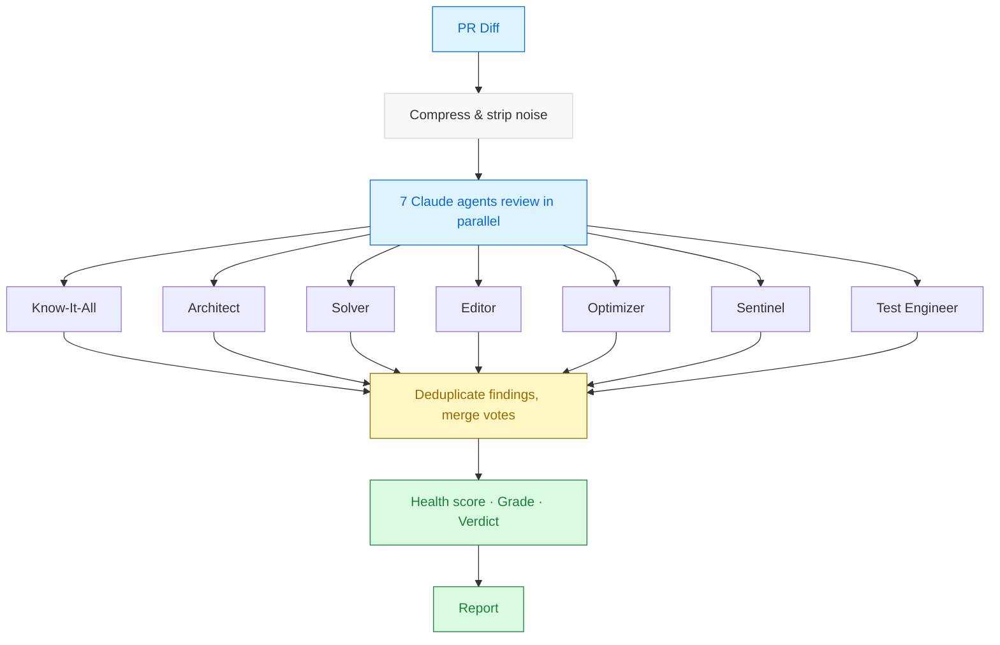

<div align="center">

# Prism

*There are problems lurking in your codebase — you just haven't looked through the right lens yet.*

[](https://go.dev)
[](https://www.anthropic.com)
[](https://github.com/arinorr/prism/actions/workflows/ci.yml)
[](LICENSE)

</div>

---

Single-pass AI review has blind spots. Prism dispatches 7 specialized Claude agents in parallel, deduplicates their findings by consensus, computes a health score, and delivers a single report with everything that matters.

## Table of Contents

<details>
<summary>Expand</summary>

- [How it Works](#how-it-works)
- [Quick Start](#quick-start)
- [Install](#install)
- [Commands](#commands)
- [Options](#options)
- [Configuration](#configuration)
- [Reviewer Roles](#reviewer-roles)
- [Health Score and Grading](#health-score-and-grading)
- [Deduplication](#deduplication)
- [Diff Compression](#diff-compression)
- [Reports](#reports)
- [Large Diffs](#large-diffs)
- [GitHub Action](#github-action)
- [Development](#development)
- [Roadmap](#roadmap)
- [License](#license)

</details>

## How it Works



<p align="right"><a href="#prism">back to top</a></p>

## Quick Start

```bash
# Build
go build -o prism .

# Review a PR (requires gh CLI and Claude Code)
prism review 42

# Review with a specific model
prism review 42 --model opus

# Review with specific roles only
prism review 42 --roles sentinel,solver,test-engineer

# Dry run (see what would happen without calling Claude)
prism review 42 --dry-run
```

<p align="right"><a href="#prism">back to top</a></p>

## Install

> [!IMPORTANT]
> Requires **Go 1.24+**, the **[gh CLI](https://cli.github.com/)** (authenticated), and **[Claude Code](https://docs.anthropic.com/en/docs/claude-code)**.

```bash
git clone https://github.com/arinorr/prism.git
cd prism
go build -o prism .

# Optional: move to your PATH
sudo mv prism /usr/local/bin/
```

<p align="right"><a href="#prism">back to top</a></p>

## Commands

### `prism review <pr-number|pr-url>`

Review a pull request. Dispatches all agents in parallel, deduplicates their findings, computes a health score, and outputs the result.

```bash
prism review 42                           # HTML report -> results/ (default)
prism review 42 --format plain            # Plain text to terminal
prism review 42 --format md               # Markdown report -> results/
prism review 42 --format json             # JSON report -> results/
prism review 42 --format md --stdout      # Print to terminal instead of file
prism review 42 --comment                 # Post inline comments on the PR
prism review 42 --roles sentinel,solver   # Only run specific agents
prism review 42 --model haiku             # Use a specific Claude model
prism review 42 --verbose                 # Show timing and debug info
prism review 42 --dry-run                 # Preview without calling Claude
```

### `prism version`

Print the version.

### `prism help`

Show help and available options.

<p align="right"><a href="#prism">back to top</a></p>

## Options

| Flag | Description |
|------|-------------|
| `--format` | Output format: `plain`, `md`, `html`, `json` (default: `html`) |
| `--comment` | Post warning/critical findings as inline PR comments |
| `--roles` | Comma-separated list of roles (default: all) |
| `--model` | Claude model: `sonnet`, `opus`, `haiku` |
| `--timeout` | Per-agent timeout as a Go duration (default: `5m`) |
| `--max-retries` | Number of retries per agent on failure (default: `1`) |
| `--max-budget-usd` | Maximum dollar spend per agent call (e.g. `0.50`) |
| `--config` | Path to config file (default: `.prism.yml`) |
| `--no-compress` | Disable diff compression (send raw diff to agents) |
| `--stdout` | Print report to terminal instead of saving to `results/` |
| `-y`, `--yes` | Skip confirmation prompts (e.g. large diff warning) |
| `-v`, `--verbose` | Show prompts, timing, token usage, and response details |
| `--dry-run` | Preview what agents would run without calling Claude |

<p align="right"><a href="#prism">back to top</a></p>

## Configuration

Prism looks for a `.prism.yml` file in the current directory (override with `--config`). All fields are optional — CLI flags take precedence.

> [!TIP]
> Fields like `diff_context_lines`, `strip_patterns`, `diff_warn_bytes`, and `diff_chunk_bytes` are **config-file only** and have no CLI flag equivalents.

<details>
<summary>Example <code>.prism.yml</code></summary>

```yaml
# .prism.yml
roles: [sentinel, solver, test-engineer]
model: sonnet
format: html
agent_timeout: 5m
max_retries: 1
max_budget_usd: 0.50

# Diff compression
no_compress: false
diff_context_lines: 1    # Lines of context around changes (1-3, or -1 for all)
strip_patterns:           # Additional glob patterns to strip from diffs
  - "*.generated.go"
  - "docs/**"

# Size thresholds (0 to disable)
diff_warn_bytes: 153600   # Warn at 150 KB (default)
diff_chunk_bytes: 307200  # Suggest splitting at 300 KB (default)
```

</details>

<p align="right"><a href="#prism">back to top</a></p>

## Reviewer Roles

| Role | Focus |
|------|-------|
| **Know-It-All** | Best practices, code smells, language idioms, naming |
| **Architect** | System fit, abstractions, coupling, dependency direction |
| **Solver** | Does the PR solve its stated problem? Edge cases, error paths |
| **Editor** | Readability, simplicity, cognitive load, duplication |
| **Optimizer** | Big-O complexity, allocations, caching, I/O efficiency |
| **Sentinel** | Injection, auth gaps, secrets, SSRF, OWASP top 10 |
| **Test Engineer** | Test coverage, missing edge cases, flaky tests, regression |

> [!NOTE]
> Agents automatically detect languages in the diff (currently Go and TypeScript/JavaScript) and load language-specific skill modules for deeper, idiomatic feedback.

<p align="right"><a href="#prism">back to top</a></p>

## Health Score and Grading

After deduplication, Prism computes a **health score** (0–100) based on the severity, scope, and consensus of findings:

| Grade | Score | Verdict | Meaning |
|:-----:|------:|---------|---------|
| `A+` | 95–100 | Approve | Excellent |
| `A`  | 90–94  | Approve | Very good |
| `B+` | 80–89  | Approve with suggestions | Good |
| `B`  | 70–79  | Approve with suggestions | Acceptable |
| `C`  | 60–69  | Request changes | Needs work |
| `D`  | 40–59  | Request changes | Significant issues |
| `F`  | 0–39   | Needs discussion | Major problems |

Findings scoped to **changed lines** are weighted more heavily than those about existing or codebase-level code. When multiple agents flag the same issue, their votes increase the finding's impact. See [`internal/agents/score.go`](internal/agents/score.go) for authoritative thresholds.

<p align="right"><a href="#prism">back to top</a></p>

## Deduplication

When multiple agents report the same issue, Prism merges them into a single finding with a **vote count** showing how many agents agreed. Deduplication uses **hybrid scoring** — structural signals (same file, same category, line proximity) lower the text similarity threshold, so semantically identical findings merge even when agents use different wording.

| Structural match | Text similarity needed |
|-----------------|----------------------|
| Same file + same category + within 20 lines | Very low (0.05) |
| Same file + same category + within 100 lines | Low (0.15) |
| Same file + within 5 lines | Standard (0.40) |

Text similarity also uses **prefix stemming** so word variants like "duplicate" and "duplication" are recognized as matching. Deduplicated findings are sorted by vote count, then severity.

<p align="right"><a href="#prism">back to top</a></p>

## Diff Compression

By default, Prism compresses diffs before sending them to agents to reduce token usage and cost:

- **Strips** lock files, generated/compiled code, binaries, and vendor/node_modules
- **Reduces context** to 1 line around changes (configurable via `diff_context_lines`)
- **Custom patterns** can be added via `strip_patterns` in `.prism.yml`

Use `--no-compress` to send the raw diff instead. After a review, token usage and cost are displayed:

```
Tokens: 142k input, 18k output | Cost: $0.34 | Time: 1m12s
```

Use `--verbose` for per-agent breakdowns.

<p align="right"><a href="#prism">back to top</a></p>

## Reports

Reports are saved to `results/` by default:

```
results/prism-pr-42.html   (default)
results/prism-pr-42.md
results/prism-pr-42.json
```

HTML reports include:
- Health score gauge with letter grade and verdict
- Dashboard summary cards
- Severity stats (critical / warning / info counts)
- Deduplicated findings grouped by file with vote counts and severity badges

Use `--stdout` to pipe reports to other tools instead.

<p align="right"><a href="#prism">back to top</a></p>

## Large Diffs

> [!WARNING]
> When a diff exceeds **150 KB**, Prism warns that review quality may be reduced. At **300 KB**, it suggests splitting the PR into smaller pieces.

Use `-y` / `--yes` to skip these prompts in CI. Thresholds are configurable in `.prism.yml`.

<p align="right"><a href="#prism">back to top</a></p>

## GitHub Action

Prism ships as a GitHub Action for automated PR reviews:

```yaml
- uses: arinorr/prism@main
  with:
    anthropic_api_key: ${{ secrets.ANTHROPIC_API_KEY }}
    format: md
    comment: true
```

See [docs/github-action.md](docs/github-action.md) for full configuration.

<p align="right"><a href="#prism">back to top</a></p>

## Development

```bash
make build       # Build the binary
make test        # Run tests with race detector
make lint        # Run golangci-lint
make check       # All quality checks (lint + test + build)
make clean       # Remove build artifacts
make review PR=2 # Build and review a PR
```

<p align="right"><a href="#prism">back to top</a></p>

## Roadmap

- [x] Multi-agent parallel review
- [x] Health scoring and grading (A+ through F)
- [x] Finding deduplication with vote counts
- [x] Diff compression and token optimization
- [x] HTML, Markdown, JSON, and plain text reports
- [x] GitHub Action for CI integration
- [x] `.prism.yml` configuration file
- [ ] Review modes (quick / standard / deep)
- [ ] Codebase Expert role
- [ ] Incremental reviews (re-review only changed files)
- [ ] Agent SDK migration

<p align="right"><a href="#prism">back to top</a></p>

## License

[MIT](LICENSE)

---

<div align="center">

Built with [Claude](https://www.anthropic.com) by [Anthropic](https://www.anthropic.com)

</div>
